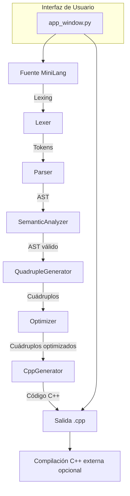

# Arquitectura del MiniLang Compiler IDE

## Visión General de la Arquitectura

MiniLang Compiler IDE está diseñado como un compilador educativo de múltiples etapas con un frontend gráfico. El flujo de compilación se organiza en módulos separados que se comunican mediante objetos de datos bien definidos:

- `src/lexer` produce tokens desde el código fuente.
- `src/parser` consume tokens para construir el AST.
- `src/semantic` recorre el AST, valida tipos y mantiene la `SymbolTable`.
- `src/intermediate` transforma el AST en cuádruplos y optimiza constantes.
- `src/codegen` genera el código de salida en C++.
- `src/ui` expone la aplicación mediante una interfaz Tkinter.

El punto de entrada `main.py` orquesta el pipeline completo cuando se compila un archivo, mientras que `run_gui.py` inicia la interfaz gráfica.

## Diagrama de Flujo

## Explicación por Fases

### 1. Módulo Léxico y Sintáctico

El analizador léxico usa `src/lexer/lexer.py` para definir tokens y palabras reservadas. Cada token se asocia a patrones regulares y conserva el número de línea mediante `lexer.lineno`.

El parser en `src/parser/parser.py` se construye con PLY Yacc. Cada regla de producción crea nodos del AST definidos en `src/parser/ast_nodes.py`. El AST captura la información de línea en cada nodo, lo cual permite generar errores sintácticos y semánticos con precisión.

Ejemplo de construcción:
- `declaracion : tipo_dato ID PUNTO_COMA` crea un nodo `Declaracion` con `linea = p.lineno(2)`.
- `expresion : expresion OP_SUMA expresion` genera un `OperacionBinaria` con `linea = p.lineno(2)`.

### 2. Módulo Semántico

`src/semantic/semantic.py` implementa un visitante sobre el AST para validar reglas del lenguaje.

La `SymbolTable` en `src/semantic/symbol_table.py` mantiene información de variables declaradas:
- nombre
- tipo
- línea de declaración

Reglas semánticas principales:
- Verificación de existencia de variables antes de su uso.
- Detección de redeclaraciones.
- Validación de tipos en asignaciones y operaciones.
- Coerción implícita: permite asignar `ENTERO` a `REAL`, pero bloquea otras incompatibilidades.

Los mensajes de error semántico se normalizan con el prefijo:

`Error Semántico (Línea X): ...`

Esto garantiza trazabilidad y facilita la depuración.

### 3. Código Intermedio y Optimización

`src/intermediate/quad_gen.py` convierte el AST en cuádruplos, una representación de tres direcciones. Cada cuádruplo tiene:
- `operador`
- `arg1`
- `arg2`
- `resultado`

El generador produce cuádruplos para:
- operaciones aritméticas y lógicas
- asignaciones
- entradas (`READ`)
- salidas (`WRITE`)
- saltos condicionales e incondicionales
- etiquetas (`LABEL`)

El optimizador en `src/intermediate/optimizer.py` aplica plegado de constantes. Si un cuádruplo de operación tiene dos operandos literales numéricos, el optimizador evalúa la expresión en tiempo de compilación y reemplaza el cuádruplo por una asignación constante.

### 4. Generación de Código Target

`src/codegen/cpp_gen.py` traduce los cuádruplos optimizados a C++ estándar.

Características clave:
- Cabeceras con `#include <iostream>` y `using namespace std;`
- Declaración de variables del usuario según la `SymbolTable`
- Declaración de variables temporales generadas por el pipeline de cuádruplos
- Mapeo de tipos MiniLang a C++:
  - `ENTERO` -> `int`
  - `REAL` -> `double`
  - `CADENA` -> `string`
  - `BOOLEANO` -> `bool`

Los cuádruplos se traducen como instrucciones C++:
- `=` se convierte en asignación estándar.
- `IF_FALSE` produce un `if (!cond) goto etiqueta;`.
- `READ` se convierte en `cin >> variable;`.
- `WRITE` se convierte en `cout << valor << endl;`.

## Componentes Principales y Responsabilidades

- `main.py` - Orquesta el pipeline completo en modo consola: léxico, sintáctico, semántico, intermedio, optimización y generación C++.
- `run_gui.py` - Inicia la interfaz Tkinter definida en `src/ui/app_window.py`.
- `src/lexer/lexer.py` - Define tokens y reglas del analizador léxico.
- `src/parser/parser.py` - Define la gramática y construye el AST.
- `src/parser/ast_nodes.py` - Define nodos AST con metadatos de línea.
- `src/semantic/semantic.py` - Realiza la validación semántica del AST.
- `src/semantic/symbol_table.py` - Gestiona el ámbito y las declaraciones de variables.
- `src/intermediate/quad_gen.py` - Genera cuádruplos a partir del AST.
- `src/intermediate/optimizer.py` - Optimiza los cuádruplos mediante plegado de constantes.
- `src/codegen/cpp_gen.py` - Genera C++ a partir de los cuádruplos optimizados.
- `src/ui/app_window.py` - Implementa la GUI para editar código y ejecutar compilaciones.

## Notas de Ingeniería

- La separación en capas facilita pruebas unitarias y mantenimiento.
- El uso de PLY hace legible la definición de gramática y la asociación de nodos AST.
- El paso intermedio de cuádruplos permite aplicar optimizaciones independientes de la generación final.
- El backend de C++ produce código legible y cercano a sintaxis imperativa estándar.
